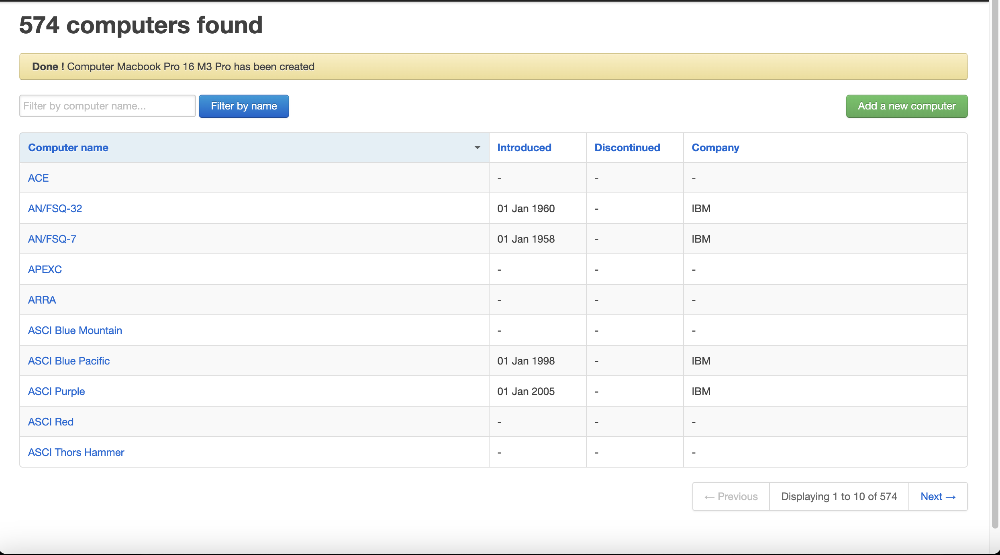
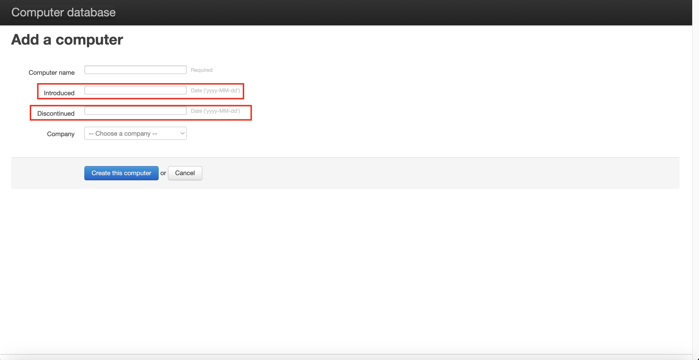
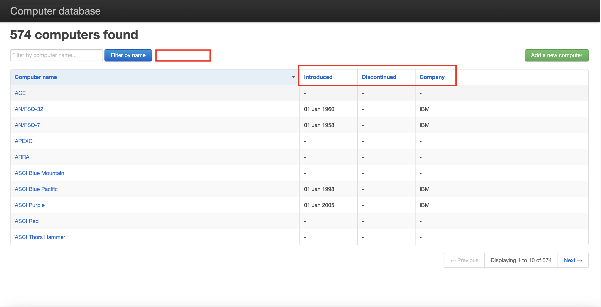

# Findings
This file contains some bugs or improvements after my exploratory tests.

## List below

### Bugs

1 - The computer gives the creation message, but the filter does not find the added model.
[video](<filter doesnt find computer .mov>)
- Expected: It should return the model created.

2- When deleting a model from the list, after the deletion confirmation message, we still finding the item in the search list
[video](<delete but we can find the computer.mov>)
- Expected: It shouldn't be visible anymore.

3 - When scrolling through the list of companies on the computer model add screen, the list leaks off the screen, and the layout crashes.
[video](<list overlap.mov>)
- Expected: It should be improved. I guess it's regarding responsiveness stuff.

### Improvements

1 - When deleting or adding a computer model, the success message modal cannot close and remains on the screen until the next reload.

2 - The field could be the year of manufacture, and the discontinue field could have an applicable checkbox so that it is not counted, in some situations, the model is still selling.

3 - Place a filter by Company and filter from the list when one is applied, the other is automatically deactivated, making it impossible for the user to use more than one filter from the list in the search.

